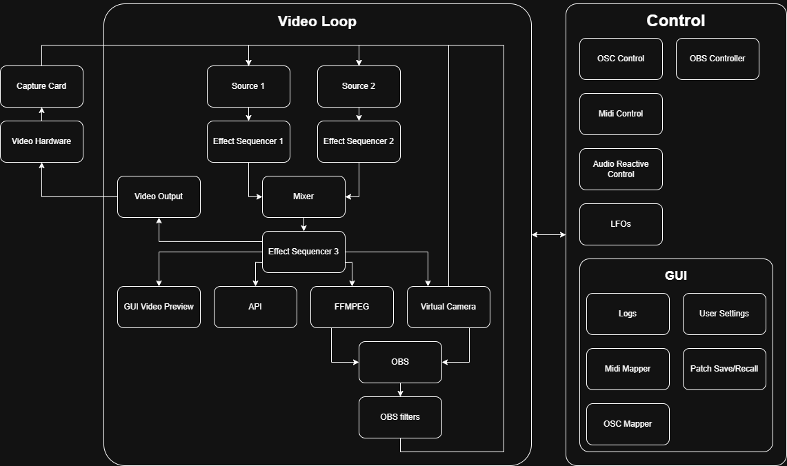

# Python Video Synthesizer

A real-time video synthesizer for creating live visual effects and generative animations. Control video processing pipelines with MIDI controllers, OSC, or a web UI - featuring modular effects, LFO modulation, procedural animations, and a REST API for remote and programmatic control.

**No expensive hardware required** - works with just a laptop webcam, though it integrates seamlessly with capture cards, MIDI controllers, and external displays.



## Table of Contents

- [Quick Start](#quick-start)
- [Features](#features)
- [Audio Reactive](#audio-reactive)
- [API & Remote Control](#api--remote-control)
- [AI Agent](#ai-agent)
- [Docker](#docker)
- [Output Methods](#output-methods)
- [Performance Profiling](#performance-profiling)
- [Architecture Overview](#architecture-overview)
- [Hardware Integration](#hardware-integration)
- [Documentation](#documentation)

---

## Quick Start

### Requirements

- **Python 3.11+**
- Webcam (optional — works with animations only)
- MIDI controller (optional)
- OBS Studio (optional)
- FFmpeg (optional)
- OSC controller (optional)

### Installation

```bash
# Clone repository
git clone <repository-url>
cd video_synth

# Create and activate virtual environment
python -m venv .venv
source .venv/bin/activate       # Linux/Mac
.venv\Scripts\activate          # Windows

# Install dependencies
pip install -r requirements.txt

# Build the web UI (required for /ui/ endpoint)
cd web && npm install && npm run build && cd ..

# Run
PYTHONPATH=src:src/video_synth python -m video_synth
```

### Command Line Options

```bash
PYTHONPATH=src:src/video_synth python -m video_synth --help

Options:
  -l, --log-level       Set logging level (DEBUG, INFO, WARNING, ERROR)
  -nd, --devices        Number of USB capture devices to search for (default: 5)
  -pn, --patch          Load saved patch by index (default: 0)
  -f, --file            Use alternate save file
  -c, --control-layout  GUI layout: SPLIT, QUAD_PREVIEW, QUAD_FULL
  -o, --output-mode     External window: NONE, WINDOW, FULLSCREEN
  -d, --diagnose        Enable performance logging every N frames

  --api                 Enable REST API server for remote control
  --api-host HOST       API server host (default: 127.0.0.1)
  --api-port PORT       API server port (default: 8000)
  --ffmpeg              Enable FFmpeg output to file or stream
  --ffmpeg-output PATH  Output path or stream URL: udp://, srt://, rtmp:// (default: output.mp4)
  --ffmpeg-preset PRE   Encoding preset (ultrafast..veryslow, default: medium)
  --ffmpeg-crf CRF      Quality 0-51, lower=better (default: 23)
  --no-virtualcam       Disable virtual camera output (enabled by default)
  --headless            Run without GUI (requires --api or --ffmpeg)
  --obs                 Enable OBS WebSocket connection for remote filter control
  --obs-host HOST       OBS WebSocket host (default: localhost)
  --obs-port PORT       OBS WebSocket port (default: 4455)
  --obs-password PASS   OBS WebSocket password
  --osc                 Enable OSC server for real-time parameter control
  --osc-host HOST       OSC server host (default: 0.0.0.0)
  --osc-port PORT       OSC server port (default: 9000)
```

**Examples:**

```bash
# Standard usage with performance monitoring
PYTHONPATH=src:src/video_synth python -m video_synth --diagnose 100 --output-mode FULLSCREEN

# API-controlled with FFmpeg recording
PYTHONPATH=src:src/video_synth python -m video_synth --api --ffmpeg --ffmpeg-output recording.mp4

# Headless server mode, streaming over UDP (near-zero latency)
PYTHONPATH=src:src/video_synth python -m video_synth --headless --api --ffmpeg \
  --ffmpeg-output udp://127.0.0.1:1234 --ffmpeg-preset veryfast

# Full Docker stack (synth + Ollama AI agent — no Python install needed)
docker compose up --build
```

---

## Features

### Video Processing Pipeline

- **Dual-Source Mixer**
  - Alpha blending
  - Luma keying (key on bright or dark areas)
  - Chroma keying (green screen)
  - Mix camera feeds, video files, images, or animations

- **Effect Sequencer**
  - Drag-and-drop effect ordering
  - Three independent effect chains (Source 1, Source 2, Post-Mix)
  - Enable/disable effects dynamically

- **LFO Modulation System**
  - Link oscillators to any parameter
  - 5 waveforms: Sine, Square, Triangle, Sawtooth, Perlin Noise
  - Nested LFOs (modulate LFO parameters with other LFOs)
  - Per-parameter cutoff ranges

- **Audio Reactive Modulation**
  - Link any parameter to audio frequency bands
  - 5 FFT bands: Bass, Low Mid, Mid, High Mid, Treble
  - Per-band sensitivity, attack/decay envelope, cutoff range
  - Microphone or line-in input via sounddevice

### Effects Categories

**Color**
- HSV manipulation (hue rotation, saturation, value)
- Brightness/contrast adjustment
- Solarization and posterization
- Color polarization

**Pixels**
- Noise (Gaussian, salt & pepper)
- Blur (TODO: list modes...)
- Sharpen (TODO: list modes...)
- Edge detection

**Transform**
- Pan, tilt, zoom (PTZ)
- Reflection (horizontal, vertical, kaleidoscope)
- Polar coordinate transform
- Warp effects (sine, radial, fractal, perlin, feedback warp)
- Feedback warp: self-referential displacement maps for chaotic patterns

**Temporal**
- Feedback blending (alpha)
- Frame averaging and temporal filtering
- Luma feedback
- Pattern feedback modulation (self-warping pattern accumulation)

**Glitch**
- Scanline displacement, color channel splitting
- Block corruption, random rectangles
- Slitscan (directional, reversible, wobble, blending modes)
- Echo/stutter (probability-based frame freeze)
- Sync modulation emulation

### Procedural Animations

All animations are fully parametric with real-time adjustment:

- **Metaballs** — Organic blob simulation with configurable physics
- **Moire Patterns** — 7 pattern types (line, radial, grid, spiral, diamond, checkerboard, hexagonal)
- **Reaction Diffusion** — Gray-Scott chemical simulation
- **Plasma** — Classic demoscene plasma effect
- **Strange Attractors** — Chaotic systems (Lorenz, Clifford, De Jong, Aizawa, Thomas)
- **Physarum** — Slime mold simulation
- **Shaders** — 11 procedural shaders (fractal, plasma, galaxy, etc.)
- **DLA** — Diffusion-limited aggregation
- **Chladni** — Vibration pattern simulation
- **Voronoi** — Cellular tessellation
- **Lenia** — Continuous cellular automata
- **Harmonic Interference** — Superimposed wave fields
- **Fractal Zoom** — Mandelbrot/Julia set navigator
- **Oscillator Grid** — Coupled oscillator lattice
- **Drift Field** — Perlin-noise vector field

### OSC (Open Sound Control)

- Receive real-time parameter control from OSC-capable applications (TouchOSC, Max/MSP, etc.)
- Address pattern maps directly to parameter names
- UDP-based, low-latency

### Web UI

Enable the REST API (`--api`) and open `http://localhost:8000/ui/` for a browser-based control surface — useful for local network collaboration or headless deployments.

### Patch System

- Save/recall parameter configurations
- YAML-based patch storage in `save/`
- Multiple patch slots per save file
- GUI patch browser
- Generate patches programmatically with `scripts/write_patches.py`

---

## Audio Reactive

Drive any parameter from live audio input. The audio reactive system analyzes microphone or line-in audio via FFT and maps frequency band energy to parameter values in real time.

### How It Works

1. Audio is captured via `sounddevice` (PortAudio) in a background thread
2. Each frame, the audio buffer is analyzed with a windowed FFT
3. Magnitude spectrum is split into 5 frequency bands:
   - **Bass** (20–250 Hz) — kick drums, bass guitar
   - **Low Mid** (250–500 Hz) — warmth, body
   - **Mid** (500–2000 Hz) — vocals, snare
   - **High Mid** (2000–6000 Hz) — presence, cymbals
   - **Treble** (6000–20000 Hz) — air, brightness
4. Band energy is smoothed with per-band attack/decay envelope followers
5. Smoothed energy is mapped to the linked parameter's range

### Linking Parameters

Each slider parameter has an **AUD** button (orange when active) next to the LFO button. Click it to open the audio link dialog:

- **Band** — Which frequency band to follow
- **Sensitivity** (0.0–5.0) — Gain multiplier on the band energy
- **Attack** (0.0–1.0) — How fast the value rises with the audio
- **Decay** (0.0–1.0) — How fast the value falls when audio drops
- **Cutoff Min/Max** — Clamp the output range (same as LFO cutoffs)

A parameter can have both an LFO and an audio band linked simultaneously.

---

## API & Remote Control

Enable the REST API with `--api` to control the synthesizer programmatically. The API runs on a background thread and provides full parameter access.

```bash
PYTHONPATH=src:src/video_synth python -m video_synth --api           # Default: 127.0.0.1:8000
PYTHONPATH=src:src/video_synth python -m video_synth --api --api-host 0.0.0.0   # Expose to network
```

Interactive docs at `http://127.0.0.1:8000/docs` (Swagger UI).

### Key Endpoints

| Method | Endpoint | Description |
| --- | --- | --- |
| GET | `/` | Health check |
| GET | `/params` | List all parameters with current values |
| GET | `/params/{name}` | Get a single parameter |
| PUT | `/params/{name}` | Set parameter value (`{"value": 42}`) |
| POST | `/params/reset/{name}` | Reset parameter to default |
| GET | `/snapshot` | Current frame as JPEG image |
| GET | `/stream` | MJPEG video stream |
| GET | `/ui/` | React web UI |
| GET | `/lfo` | List active LFOs |
| POST | `/lfo/{param}` | Attach an LFO to a parameter |
| DELETE | `/lfo/{param}` | Remove an LFO |
| POST | `/patch/next` | Load next patch |
| POST | `/patch/random` | Load random patch |

Full reference: [docs/api.md](docs/api.md)

### Python Example

```python
import requests

API = 'http://127.0.0.1:8000'

# Set a parameter
requests.put(f'{API}/params/hue_shift', json={'value': 90})

# Attach an LFO
requests.post(f'{API}/lfo/hue_shift', json={'rate': 0.5, 'amplitude': 0.3, 'shape': 'sine'})

# Save a snapshot
img = requests.get(f'{API}/snapshot')
with open('frame.jpg', 'wb') as f:
    f.write(img.content)
```

### Headless Mode

```bash
PYTHONPATH=src:src/video_synth python -m video_synth --headless --api --no-virtualcam
```

Headless mode requires at least `--api` or `--ffmpeg`. No GUI window is created — all control is via the web UI or API.

---

## AI Agent

Use an Ollama-powered local LLM agent to control the synthesizer through natural language. Describe the visuals you want and the agent translates your intent into parameter changes in real time.

```
"slow hypnotic blue pulse"  →  agent sets hue, attaches sine LFOs, adjusts feedback
"chaotic glitch storm"      →  agent cranks glitch params, randomizes warp
"load something ambient"    →  agent calls /patch/random and refines from there
```

The agent runs as a separate service at `http://localhost:8001` and communicates with both the synth API and a local Ollama instance — **no data leaves your machine**.

⚠️**Caution!**⚠️
This feature is currently unstable and may crash the program. It is a gimmick, after all.

### Quick start (Docker)

Full Docker setup guide: [docs/docker.md](docs/docker.md)
Alternate local installation (including usage tips): [docs/getting-started.md](docs/getting-started.md)

```bash
docker compose up --build
```

| Service | URL | What it is |
| --- | --- | --- |
| Synth API | `http://localhost:8000` | Video synth (headless) |
| Web UI | `http://localhost:8000/ui/` | React parameter control surface |
| AI Agent chat | `http://localhost:8001` | Natural language control |
| Swagger | `http://localhost:8000/docs` | API explorer |

The agent pulls `llama3.2:3b` (~2 GB) on first start. To use a larger model, set `OLLAMA_MODEL` in `docker-compose.yml` (e.g. `llama3.1:8b`, `qwen2.5:7b`).

---

## Docker

The full stack runs in three containers orchestrated by Docker Compose:

```
ollama          ← local LLM inference (port 11434)
video_synth     ← headless synth API (port 8000)
agent           ← FastAPI + LLM agent web UI (port 8001)
```

```bash
# Build and start everything
docker compose up --build

# Rebuild after source changes
docker compose up --build --force-recreate

# Run synth only (no agent)
docker compose up video_synth
```

Model weights persist in a Docker volume (`ollama_data`) so they aren't re-downloaded on restart. Patches in `save/` are bind-mounted from the host so presets survive container restarts.

See [docs/docker.md](docs/docker.md) for full configuration reference.

---

## Output Methods

### Recording to File

```bash
PYTHONPATH=src:src/video_synth python -m video_synth --ffmpeg --ffmpeg-output recording.mp4
PYTHONPATH=src:src/video_synth python -m video_synth --ffmpeg --ffmpeg-output recording.mp4 --ffmpeg-preset slow --ffmpeg-crf 18
```

### Live Streaming

**UDP (lowest latency, no server needed):**

```bash
PYTHONPATH=src:src/video_synth python -m video_synth --api --ffmpeg \
  --ffmpeg-output udp://127.0.0.1:1234 --ffmpeg-preset veryfast
```

**SRT (low latency with error recovery):**

```bash
PYTHONPATH=src:src/video_synth python -m video_synth --api --ffmpeg \
  --ffmpeg-output "srt://127.0.0.1:1234?pkt_size=1316" --ffmpeg-preset veryfast
```

**RTMP (legacy, requires RTMP server):**

```bash
docker run -d -p 1935:1935 --name rtmp-server tiangolo/nginx-rtmp
PYTHONPATH=src:src/video_synth python -m video_synth --api --ffmpeg \
  --ffmpeg-output rtmp://localhost/live/stream --ffmpeg-preset veryfast
```

### OBS Integration

#### Method 1: Virtual Camera (default — zero latency)

The virtual camera starts automatically. In OBS, add a **Video Capture Device** source and select it from the device dropdown.

#### Method 2: UDP Media Source

1. Start with `--ffmpeg --ffmpeg-output udp://127.0.0.1:1234`
2. In OBS, add a Media Source → Input: `udp://127.0.0.1:1234`

#### Method 3: OBS WebSocket Control

```bash
PYTHONPATH=src:src/video_synth python -m video_synth --api --obs --obs-password your_password
```

See [examples/](examples/) for complete automation scripts.

---

## Performance Profiling

```bash
PYTHONPATH=src:src/video_synth python -m video_synth --diagnose 100    # Log every 100 frames
```

### Tracked Stages

| Stage | Description |
| --- | --- |
| `capture` | Camera/source frame acquisition |
| `lfo` | LFO oscillator updates |
| `audio` | Audio reactive analysis + parameter updates |
| `effects_1` / `effects_2` | Per-source effect chain processing |
| `mix` | Source blending (alpha, luma key, chroma key) |
| `post_fx` | Post-mix effect chain |
| `api_copy` | Frame copy for API snapshot endpoint |
| `ffmpeg` | FFmpeg frame encoding |
| `gui_emit` | GUI frame signal emission |

Within each effect chain, individual effect timings are tracked. The diagnostic log highlights the top 3 slowest effects per chain.

---

## Architecture Overview

### Project Layout

```text
video_synth/
├── src/video_synth/     Python package — all application source code
│   ├── animations/      Procedural frame generators (Metaballs, Plasma, DLA, ...)
│   ├── effects/         Modular effect classes (Color, Warp, Glitch, Feedback, ...)
│   ├── __main__.py      Entry point, CLI args, video loop, thread management
│   ├── api.py           FastAPI REST server + web UI static serving
│   ├── mixer.py         Dual-source mixer (alpha, luma key, chroma key)
│   ├── param.py         ParamTable / Param system (central parameter management)
│   ├── lfo.py           LFO oscillator bank
│   ├── audio_reactive.py  Audio input analysis + parameter modulation
│   ├── effects_manager.py Effect chain sequencing + performance tracking
│   ├── midi_mapper.py   Generic MIDI learn/mapping system (YAML persistence)
│   ├── osc_controller.py  OSC (Open Sound Control) server
│   ├── obs_controller.py  OBS WebSocket controller
│   └── ffmpeg.py        FFmpeg subprocess pipe (file + streaming)
│
├── agent/               Local LLM agent service (separate Docker container)
│   ├── agent.py         FastAPI + Ollama tool-calling loop + web chat UI
│   └── Dockerfile
│
├── web/                 React + Vite browser control surface
│   └── src/             Built to web/dist/ (served at /ui/)
│
├── docs/                All project documentation
│   ├── api.md           REST API reference
│   ├── docker.md        Docker + AI agent setup
│   ├── getting-started.md  Installation and first steps
│   ├── parameters-reference.md  All parameters with min/max/defaults
│   ├── roadmap.md       Phased development roadmap
│   └── build.md         PyInstaller packaging guide
│
├── tests/               pytest suite (116 tests)
├── build/               PyInstaller spec, hooks, build scripts
├── scripts/             Developer tooling (write_patches.py, etc.)
├── save/                Runtime YAML state (patches, MIDI maps, autosave)
├── shaders/             GLSL shader source files
├── samples/             Sample video files for testing
├── examples/            OBS automation and API recipe scripts
│
├── docker-compose.yml   Full stack (synth + Ollama + agent)
├── Dockerfile           Video synth container image
├── mkdocs.yml           Documentation site config (MkDocs Material)
└── CLAUDE.md            AI assistant context for Claude Code
```

### Frame Pipeline

Each video loop iteration (target ≤ 33 ms / 30 fps):

```text
src_1 animation → src_1 effects ─┐
                                  ├─ Mixer (blend mode) → post effects → output
src_2 animation → src_2 effects ─┘
```

Output destinations run in parallel: GUI window, virtual camera, FFmpeg pipe, API snapshot buffer.

---

## Hardware Integration

### MIDI Controllers

Any MIDI controller with knobs/sliders works. Use the MIDI learn button next to any parameter to bind a CC. Mappings are saved automatically to `save/midi_mappings.yaml`.

### Capture Devices

Use `-nd` to set how many USB devices to scan. Works with USB webcams, HDMI/SDI capture cards (Elgato, Blackmagic), and virtual cameras.

### External Display

```bash
PYTHONPATH=src:src/video_synth python -m video_synth --output-mode WINDOW       # Separate output window
PYTHONPATH=src:src/video_synth python -m video_synth --output-mode FULLSCREEN    # Fullscreen on secondary display
```

---

## Documentation

| Document | Description |
| --- | --- |
| [docs/getting-started.md](docs/getting-started.md) | Full installation walkthrough, all run modes |
| [docs/api.md](docs/api.md) | Complete REST API reference with examples |
| [docs/docker.md](docs/docker.md) | Docker stack setup, AI agent configuration |
| [docs/parameters-reference.md](docs/parameters-reference.md) | Every parameter with min/max/defaults |
| [docs/roadmap.md](docs/roadmap.md) | Development roadmap (phases 1–4) |
| [docs/build.md](docs/build.md) | Packaging as a standalone executable |
| [examples/](examples/) | OBS automation and API recipe scripts |

To preview the documentation site locally:

```bash
pip install -r requirements_docs.txt
mkdocs serve
```
